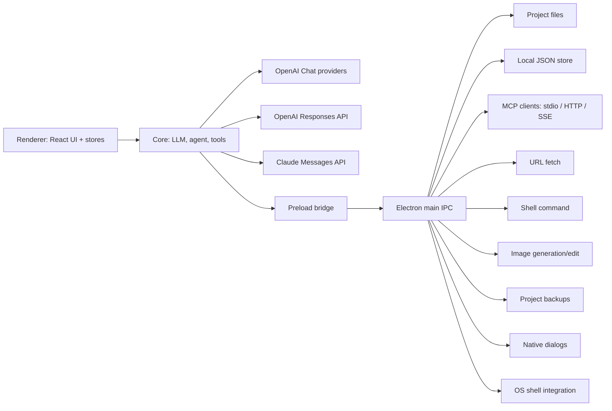
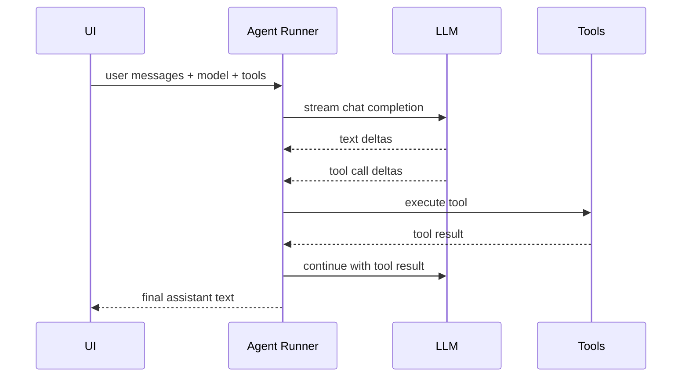

# Architecture

## Boundary

The rebuild follows the architecture discovered from static analysis:

The main process owns local system capabilities. The renderer owns model selection, agent orchestration, and UI state. This matches the observed app shape where LLM calls are renderer-side while local system features are exposed through preload IPC.

## LLM Flow

1. UI selects a scenario model or an agent-profile runtime override.
2. `resolveModel` maps `provider/model` to an interface config.
3. `streamChatCompletion` routes by `requestFormat`: OpenAI Chat Completions, OpenAI Responses API, or Claude Messages API.
4. Messages and tool definitions are converted into the selected provider shape, including function/tool-call history.
5. Streaming chunks or SSE events are normalized into text deltas, tool calls, and usage events.

Provider-specific headers are injected in `buildDefaultHeaders`.

## Agent Flow

The loop is intentionally small:

- max tool steps defaults to 42
- context trimming keeps system and recent messages
- tool calls are executed serially
- tool results are appended as `role: "tool"` messages

## Main IPC

Current IPC channels:

- `app:get-snapshot`
- `project:get-projects`
- `project:create-project`
- `project:open-project`
- `project:rename-project`
- `project:delete-project`
- `project:read-config`
- `project:write-config`
- `skill:list`
- `skill:list-directory`
- `skill:create`
- `skill:delete`
- `agent:list-files`
- `agent:read-content`
- `agent:write-content`
- `agent:create-file`
- `agent:delete-file`
- `sub-agent:list-sessions`
- `sub-agent:write-session`
- `sub-agent:delete-session`
- `project:set-root`
- `project:list-directory`
- `project:read-file`
- `project:write-file`
- `project:create-entry`
- `project:rename-entry`
- `project:delete-entry`
- `project:move-entry`
- `project:search-in-files`
- `project:search-files`
- `project:read-file-data-url`
- `project:build-smart-context`
- `project:generate-smart-context`
- `dialog:open-text-file`
- `dialog:save-text-file`
- `dialog:save-binary-file`
- `dialog:save-pdf-from-html`
- `dialog:select-directory`
- `shell:show-item-in-folder`
- `shell:open-project-path-external`
- `shell:show-project-path-in-folder`
- `shell:open-project-folder`
- `image:generate`
- `image:edit`
- `backup:create`
- `backup:list`
- `ai:get-config`
- `ai:save-config`
- `mcp:get-config`
- `mcp:save-config`
- `settings:get-local`
- `settings:save-local`
- `mcp:list-tools`
- `mcp:call-tool`
- `mcp:close-all`
- `network:fetch-url-content`
- `command:run`
- `window:minimize`
- `window:toggle-maximize`
- `window:close`

## Built-in Tool Parity

The reversed built-in tool list is preserved in `src/core/tools/builtinTools.ts` as `reversedToolNames`. The rebuild currently registers all 30 names through local IPC, network fetch, knowledge search, image generation/edit, todo/options helpers, history listing, command execution, and renderer-backed sub-agent execution:

`list_project_files`, `list_directory`, `read_file_content`, `search_in_files`, `search_project_files`, `get_file_info`, `search_internet`, `fetch_url_content`, `semantic_search`, `get_chapter_summary`, `build_smart_context`, `create_file_or_folder`, `rename_file`, `delete_file_or_folder`, `move_file`, `write_file_content`, `replace_content_words`, `move_file_to_index`, `update_chapter_status`, `rename_project`, `todo_write`, `create_options`, `manipulate_file_lines`, `generate_image`, `edit_image`, `search_knowledge_base`, `ask_full_text`, `call_sub_agent`, `list_history_sessions`, `run_command`.

## Roadmap

1. Expand local-first equivalents for original cloud marketplace/social behaviors where they can be represented without login.
2. Add image generation scenarios beyond OpenAI-compatible Images API providers when those provider protocols are known.
3. Keep auditing original follow-up screens against the rebuild: editor, settings, prompt library, model config, and dialogs.
